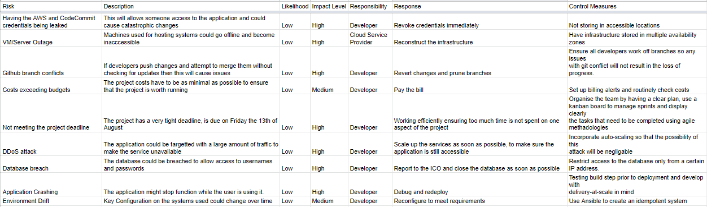

# Team 2 - QA Final Group Project 

## Contents
[1. Team Members](#team-members)

[2. Project Background](#background)

[3. The Application](#the-application)

[4. Build Server](#build-server)

[5. Project Management](#project-management)

[6. Risk Assessment](#risk-assessment)

## Team Members:
* Adi Carlisle
* Artas Gill
* Layek Hakim
* Orland Lleshi

## Background:
The team's brief was to:
1. Review the design and requirements for the Pet Clinic application.
2. Select the appropriate tools and application to automate both test and production installation.
3. Create a full CD/CI deployment

## The Application:
Pet Clinic WebApp has three components
1. A front-end written in angular js 
2. A back-end restful API version of the written in java (Link). 
3. A database connected to the back-end, running on MySQL.

## Build Server
The Build Server is use to create the various stages of the build process. The server is the host to the following applications:

- Terraform to build Environments

- Jenkins for CD/CI automation

- Docker for containerisation

- Kubernetes to Deploy instances to the Environments

- A golden AMI for instance configuration

The initial build server was based on an AWS t2.micro instance, this quickly proved to be inadequate, especially for building DOCKER containers, so we tackled this problem by rebuilding using a single AWS T3.medium instance.

## Project Management:
The team review the choice of software to manage the project and decided on TRELLO. Since the beginning of the project, the appointed Scrum Master has been hosting meetings daily at 9am.

## Risk Assessment:
It is fundamentally important to carry out a risk assessment for any project as many different potential risks could occur. Below is the risk assessment that was created to be prepared for any potential problems we could face with this project. This is where we have outlined potential risks, their impacts, who is responsible for it and mitigation techniques that we may need. 

The team conducted a simple risk assessment:

The initial sprint was designed to deploy the application itself, each member was assigned to complete different tasks,to ensure everyone was on track and tasks are being completed thoroughly, we had scrum meetings every morning. After the first sprint, the second sprint was initialised which looked like this:

This sprint included the in-depth analysis of the final project, along with a few extensive suggestions that were added once the sprint review and retrospective has been completed. Given that the deployment was successful, each step had to be documented in order to show not only the process, but the progress that the team made during the course of this project.

## 7. 
