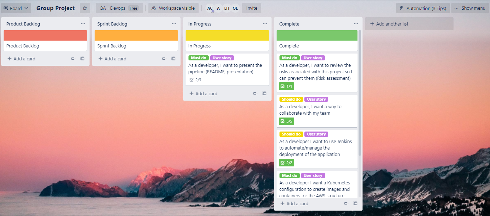
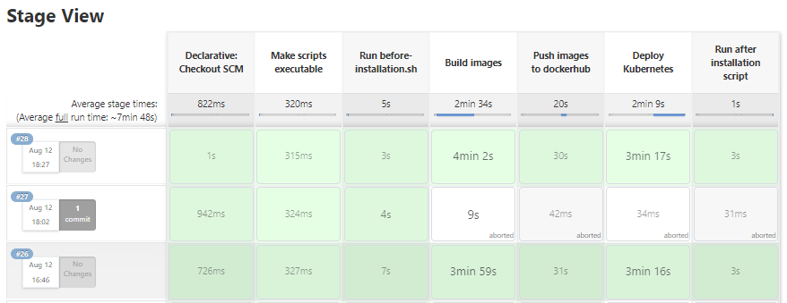

# Team 2 - QA Final Group Project 

## Contents
[1. Team Members](#team-members)

[2. Project Background](#background)

[3. The Application](#the-application)

[4. Build Server](#build-server)

[5. Project Management](#project-management)

[6. Risk Assessment](#risk-assessment)

[7. Git](#git)

[8. Docker](#docker)

[9. Terraform](#terraform)

[10. Kubernetes](#kubernetes)

[11. Jenkins](#jenkins)

## Team Members:
* Adi Carlisle - Scrum master/Developer
* Artas Gill - Product Owner/Developer
* Layek Hakim - Developer
* Orland Lleshi - Developer

## Background:
The team's brief was to:
1. Review the design and requirements for the Pet Clinic application.
2. Select the appropriate tools and application to automate both test and production installation.
3. Create a full CD/CI deployment

## The Application:
Pet Clinic WebApp has three components
1. A front-end written in angular js 
2. A back-end restful API version of the written in java (Link). 
3. A database connected to the back-end, running on MySQL.

## Build Server
The Build Server is use to create the various stages of the build process. The server is the host to the following applications:

- Terraform to build our cloud infrastructure

- Jenkins for CD/CI automation

- Docker for containerisation

- Kubernetes to deploy container pods to the cloud infrastructure 

- Nginx for load balancing

The initial build server was based on an AWS t2.micro instance to keep costs as low as possible, this proved to be insufficient, especially for building containers in Docker, so we tackled this problem by rebuilding using an AWS T3.medium instance instead.

## Project Management:
The team decided to use Trello as the kanban board to manage the project. Since the beginning of the project, the appointed Scrum Master has been hosting daily meetings at 9am. The initial sprint was designed to deploy the application itself, each member was assigned to complete different tasks,to ensure everyone was on track and that tasks are being completed thoroughly.

The full trello board can be found [here](https://trello.com/b/AToVlk0R/group-project) 

## Risk Assessment:
It is fundamentally important to carry out a risk assessment for any project as many different potential risks could occur. Below is the risk assessment that was created to be prepared for any potential problems we could face with this project. This is where we have outlined potential risks, their impacts, who is responsible for it and the mitigation techniques that may be required. 

The team conducted a simple risk assessment:

The full risk assessment can be found [here.](https://docs.google.com/spreadsheets/d/1y8_6TKX1bgOXZmLeAeGyb0GnfeRtMTwjUdh6LXgdtLs/edit?usp=sharing)

## GIT
The team uses GIT as a code repository tool:

To reference the two Pet Clinic repo's.
To host our solution to the deployment process, including all code and documentation.

 

## Docker 
Docker had two application services, one frontend and one backend, and a supporting database. The images were built and containerised. The database was created with the Relational Database Service on AWS. It's container was also built using the same instance. Images of the containers were pushed onto Dockerhub. Kubernetes would then manage and build them. The environment.ts directive instructs the front end application to interface with the back end, pulling database information to display on the site and allowing CRUD capability.

## Terraform
The chosen tool for infrastructure orchestration was Terraform. The core takes input of both Terraform configuration file and state to decide what actions need to be taken. Once, the core creates an execution plan it will then use providers from specific technologies to execute the plan. Terraform was used as the provisioning tool to set up the Elastic Kubernetes service cluster alongside a yaml file. This allows for easy configuration and management. Terraform allows us to automate and manage the infrastructure,platform and the services that run on the infrastructure.

## Kubernetes

Kubernetes is an open source container orchestration tool which is designed to automate, deploy, scale and operate containerised applications.

Kubernetes is a distributed system where by multiple machines are configured to form a cluster. Machines may be a mix of physical and virtual and they may exist in cloud infrastructure each with their own unique hardware configurations. Kubernetes can also  move containers to different machines as these machines are added or removed.

EKS
We used this service in AWS to create, configure and manage a Kubernetes Cluster. To do this we had to
establish the required security credentials for IAM users, the node group role and the cluster role. We also generated the required SSH keys to secure logging into our AWS instances. Some of the tools we had to set up are the AWS CLI, KUBECTL and EKSCTL

## Jenkins
The image we have included below represents our final continuous integration pipeline with the associated framework and services. It is a breakdown of the tools and services used to deploy a functioning program. The services we have chosen within the pipeline provides the most efficient method of rapid development to be tested and automated.

